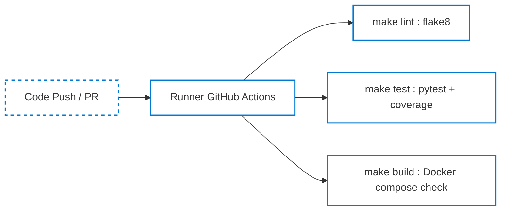
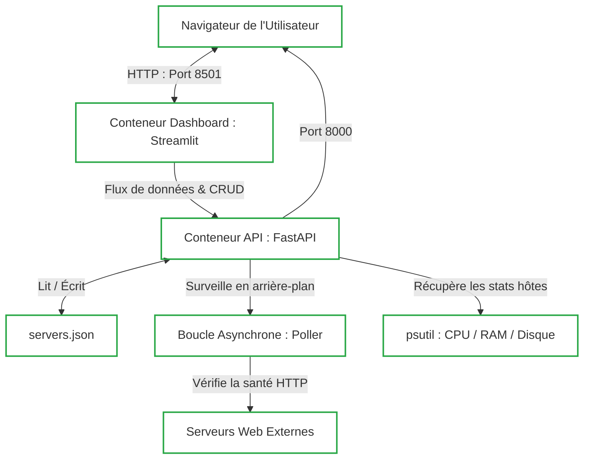

# DevOps Monitoring Dashboard

Ce projet est un système complet de supervision (monitoring) en temps réel construit entièrement en Python. Il se compose d'un backend FastAPI collectant les métriques locales (CPU, RAM, Disque) et d'un frontend Streamlit permettant de visualiser ces métriques et de gérer des serveurs surveillés.

---

## Architecture & CI/CD Pipeline

Le projet est structuré autour d'un pipeline de validation automatique (CI) et d'une stack de conteneurs locale :

### 1. Pipeline d'Intégration Continue (GitHub Actions CI)

Le pipeline de CI valide automatiquement chaque modification poussée sur la branche `main` :



### 2. Architecture du Système Local (Docker Stack)

L'architecture s'exécute localement dans un réseau de conteneurs Docker isolé :



---

## Prérequis

Pour exécuter ce projet localement, assurez-vous d'avoir installé :
* **Python 3.11** ou supérieur
* **Docker** et **Docker Compose**
* **Make** (facultatif, pour utiliser les raccourcis de commande du Makefile)

---

## 🚀 Lancement Rapide

L'automatisation complète est gérée via le `Makefile`.

### Option A : Déploiement Local avec Docker Compose (Recommandé)
Préparez l'environnement et lancez l'ensemble de l'architecture en une seule commande :
```bash
cp .env.example .env   # remplir les valeurs si nécessaire
make up                # démarre la stack
```
* **Dashboard Streamlit** : accessible sur [http://localhost:8501](http://localhost:8501)
* **API FastAPI** : accessible sur [http://localhost:8000](http://localhost:8000)
* **Documentation interactive Swagger** : [http://localhost:8000/docs](http://localhost:8000/docs)
* **Métriques brutes JSON** : [http://localhost:8000/metrics](http://localhost:8000/metrics)

Pour consulter les logs en temps réel :
```bash
make logs
```

Pour arrêter les conteneurs et nettoyer les volumes :
```bash
make down
```

### Option B : Lancement Local en Mode Développement (Sans Docker)
1. Activez votre environnement virtuel Python 3.11.
2. Installez les dépendances requises :
   ```bash
   pip install -r requirements.txt
   ```
3. Exécutez le script d'automatisation :
   ```bash
   make dev
   ```

---

## 🧪 Qualité du Code & Tests

Le projet est configuré pour maintenir des standards de qualité élevés.

### 1. Analyse Statique (Linting)
Vérifiez la conformité du code avec les standards PEP 8 :
```bash
make lint
```

### 2. Tests Unitaires & Couverture
Exécutez la suite de tests unitaires et vérifiez que le taux de couverture dépasse les 75 % requis :
```bash
make test
```

---

## 🛠️ Spécifications des Endpoints de l'API

L'API FastAPI expose les routes suivantes :

| Méthode | Endpoint | Authentification | Description |
| :--- | :--- | :--- | :--- |
| **GET** | `/health` | Non | Liveness probe pour Kubernetes/Azure App Service |
| **GET** | `/metrics` | Non | Récupère les métriques hôtes (CPU, RAM, Disque) via psutil |
| **WS** | `/ws/metrics` | Non | Stream JSON des métriques mis à jour toutes les secondes |
| **POST** | `/servers` | Clé API | Enregistre un nouveau serveur à surveiller |
| **GET** | `/servers` | Non | Liste les serveurs enregistrés (supporte le filtre `?status=UP`) |
| **GET** | `/servers/{id}` | Non | Récupère les détails d'un serveur spécifique |
| **DELETE**| `/servers/{id}`| Clé API | Supprime un serveur de la liste de monitoring |
| **POST** | `/servers/{id}/check`| Non | Déclenche un health check manuel immédiat |

> [!TIP]
> Pour tester les endpoints sécurisés, incluez le header `X-API-Key` avec la valeur configurée dans votre `.env` (ex: `X-API-Key: dev-secret-change-in-prod`).

---

## Variables d'Environnement Expliquées

Le fichier `.env` à la racine contrôle la configuration :
* `API_KEY` : Clé d'API secrète requise pour authentifier et autoriser les opérations d'écriture (`POST /servers`, `DELETE /servers/{id}`).
* `API_BASE_URL` : URL de communication utilisée par le tableau de bord pour appeler l'API (configurée par défaut sur `http://api:8000` au sein du réseau Docker).

---

## Déploiement Azure & URLs Live

> [!NOTE]
> Conformément aux consignes de travaux pratiques sans compte d'abonnement actif, le déploiement sur le cloud Azure a été désactivé dans le pipeline de CI/CD. Les fichiers de configuration restent pleinement rédigés et utilisables.

* **URL de l'API live (Docs)** : `N/A - Exécution locale uniquement`
* **URL du Dashboard live** : `N/A - Exécution locale uniquement`
